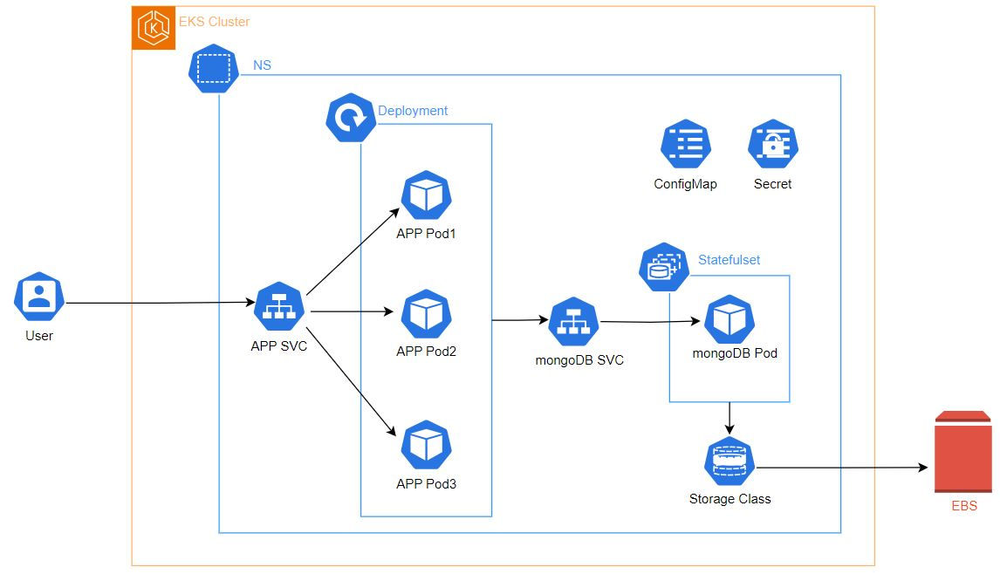

# Deploy a microservice application in AWS EKS Cluster.
This project shows how to deploy a microservice application (a nodeJS API with mongoDB) in Elastic Kubernetes Service (EKS).  
The figure below decribes the architecture of the application.

## How to create an EKS Cluster
To know how to create a kubernates cluster in AWS, please folow steps described in [this article](https://medium.com/@jbalifoued/how-to-create-an-eks-cluster-in-aws-62b1c6964925).

## How to deploy a microservice application in EKS Cluster
To show you how to deploy a microservice application (nodeJS API), please follow steps described in [this article](https://medium.com/@jbalifoued/deploy-a-nodejs-application-in-aws-eks-cluster-5a6a697c896b).